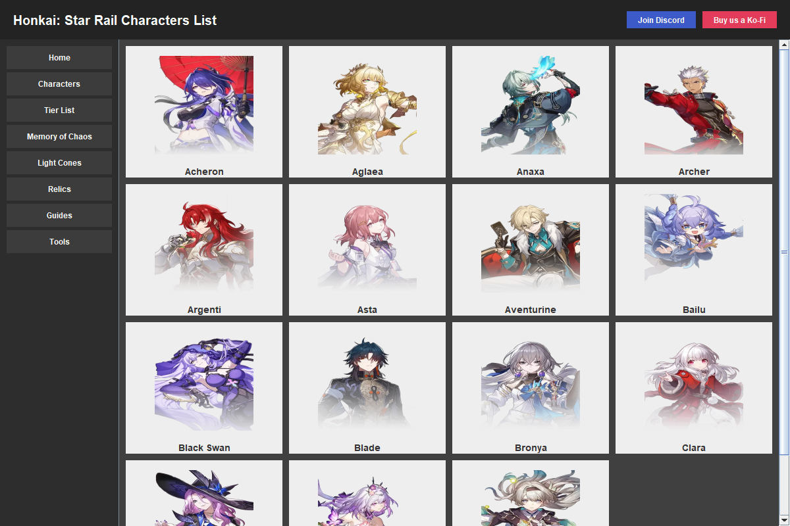

# Java Swing UI - Honkai: Star Rail Inspired Interface

A custom-designed Java Swing UI inspired by the character selection menu in Honkai: Star Rail. This project showcases a modern desktop layout using `JFrame`, `JSplitPane`, `JPanel`, and custom-drawn components. Built with Java Swing and Gradle.



---

## ✨ Features

* Frameless, draggable, and resizable main window
* Sidebar navigation with visually highlighted buttons
* Dynamic content swapping (Home, Characters, etc.)
* Scrollable character grid with image cards
* Character card click behavior (e.g. opens `AcheronPanel`)
* Custom dark/light themed components
* Custom ScrollBar UI with arrow rendering (↑ ↓ ← →)
* Modern flat UI with rounded corners

---

## 🧱 Technologies Used

* Java 17+
* Java Swing (UI components)
* Gradle (build system)
* VSCode + Java Extensions

---

## 🧩 Folder Structure

```
Java-Swing-UI/
├── app/
│   └── src/
│       ├── main/
│       │   ├── java/hsr_java_gui_gradle/   # All main source files
│       │   └── resources/images/          # Character images
│       └── test/                          # Optional test folder
├── build.gradle
├── settings.gradle
└── README.md
```

---

## 🚀 Getting Started

### Prerequisites

* Java 17 or higher
* Gradle installed or use the included `gradlew`

### Run the App

```bash
./gradlew run
```

Or manually compile and run from `App.java`.

---

## 🧙‍♂️ Navigation Logic

* Sidebar buttons (`SidebarPanel`) use a listener to update the main content panel via `App.switchContentPanel(...)`
* New character detail pages (e.g. `AcheronPanel.java`) are shown when their corresponding `CharacterCard` is clicked.

---

## 📦 Future Ideas

* Add more character panels
* Implement filter/sorting in CharacterGrid
* Add animations (hover/fade/slide transitions)
* Export character data from a JSON file
* Implement light/dark theme switcher

---

## 🙌 Credits

This project was created by [@wyattmatt](https://github.com/wyattmatt) as a UI design showcase.

---

> Designed with love, inspired by HoYoverse.